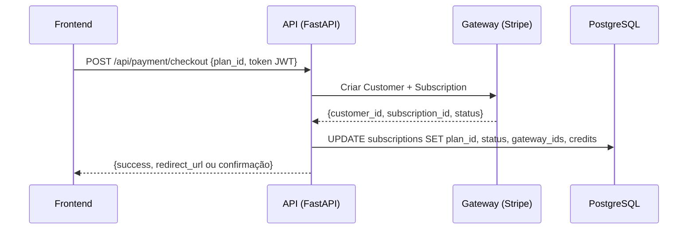
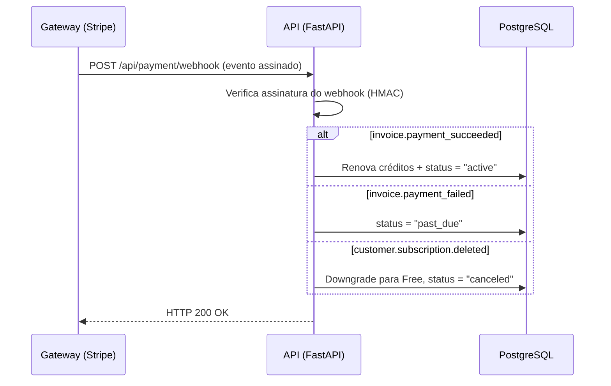

# 💳 Integração com Gateway de Pagamento (Cartão de Crédito)

Este documento explica a arquitetura completa para integrar um gateway de pagamento com cartão de crédito ao ScreenAI API, incluindo fluxos de verificação, mudança de plano e renovação automática.

---

## 1. Gateways Recomendados para o Brasil

| Gateway | Vantagens | Taxas |
|---|---|---|
| **Stripe** | Mais completo, melhor documentação, webhook robusto | 3.99% + R$0.39 |
| **Mercado Pago** | Popular no Brasil, PIX integrado | 4.99% |
| **PagSeguro** | Boa cobertura, parcelamento fácil | 3.99% – 5.99% |
| **Asaas** | Focado em recorrência/SaaS, boleto + PIX + cartão | A partir de 2.99% |

> **Recomendação**: Para SaaS com recorrência mensal, o **Stripe** ou **Asaas** são os mais indicados. O Stripe tem a melhor documentação e suporte a webhooks.

---

## 2. Estrutura Atual do Banco de Dados

O sistema já possui as tabelas necessárias para suportar pagamentos:

```
┌──────────────┐     ┌──────────────────┐     ┌──────────────┐
│    users     │     │  subscriptions   │     │    plans     │
├──────────────┤     ├──────────────────┤     ├──────────────┤
│ id (PK)      │◄────│ user_id (FK)     │     │ id (PK)      │
│ email        │     │ plan_id (FK)     │────►│ name         │
│ hashed_pass  │     │ status           │     │ price        │
│ is_active    │     │ remaining_credits│     │ monthly_cred │
│ created_at   │     │ current_period_  │     │ is_active    │
└──────────────┘     │   end            │     └──────────────┘
                     │ created_at       │
                     │ updated_at       │
                     └──────────────────┘
```

### Campos que precisam ser ADICIONADOS à tabela `subscriptions`:

```python
# Em app/models/subscription_model.py, adicionar:
gateway_customer_id    = Column(String, nullable=True)   # ID do cliente no Stripe (ex: cus_xxx)
gateway_subscription_id = Column(String, nullable=True)  # ID da assinatura no Stripe (ex: sub_xxx)
```

---

## 3. Planos Atuais no Sistema

| ID | Nome | Preço | Créditos/Mês | Modelo IA |
|---|---|---|---|---|
| 1 | Free | R$ 0 | 100 | gemini-2.5-flash-lite |
| 2 | Pro | R$ 29.90 | 1000 | gemini-2.5-flash |
| 3 | Plus | R$ 59.90 | 5000 | gemini-2.5-pro |

---

## 4. Arquitetura da Integração

### 4.1. Novos Arquivos a Criar

```
app/
├── controllers/
│   └── payment_controller.py    # [NOVO] Rotas REST para pagamento
├── services/
│   └── payment_service.py       # [NOVO] Lógica de negócio do pagamento
├── schemas/
│   └── payment_schemas.py       # [NOVO] Validação de dados de entrada
└── core/
    └── config.py                # [MODIFICAR] Adicionar chaves do gateway
```

### 4.2. Variáveis de Ambiente (`.env`)

```env
# Stripe (exemplo)
STRIPE_SECRET_KEY=sk_test_xxxxxxxxxxxxxxxxxxxxxxxx
STRIPE_PUBLISHABLE_KEY=pk_test_xxxxxxxxxxxxxxxxxxxxxxxx
STRIPE_WEBHOOK_SECRET=whsec_xxxxxxxxxxxxxxxxxxxxxxxx
```

---

## 5. Fluxos de Pagamento

### 5.1. Fluxo de Upgrade (Free → Pro/Plus)



### 5.2. Fluxo de Webhook (Renovação/Cancelamento Automático)



---

## 6. Código Exemplo para Cada Componente

### 6.1. `app/services/payment_service.py`

```python
"""
Serviço de Pagamento integrado ao Stripe.
"""
import stripe
from sqlalchemy.orm import Session
from app.core.config import settings
from app.models.subscription_model import Subscription
from app.models.plan_model import Plan
from app.core.logger import setup_logger

logger = setup_logger(__name__)
stripe.api_key = settings.stripe_secret_key

class PaymentService:

    def create_checkout_session(self, db: Session, user_id: int, plan_id: int, user_email: str):
        """
        Cria uma sessão de checkout no Stripe para o usuário fazer o pagamento.
        Retorna uma URL para redirecionar o usuário ao formulário de pagamento do Stripe.
        """
        plan = db.query(Plan).filter(Plan.id == plan_id).first()
        if not plan or plan.price == 0:
            raise ValueError("Plano inválido ou gratuito.")

        # 1. Cria (ou busca) o cliente no Stripe
        subscription = db.query(Subscription).filter(Subscription.user_id == user_id).first()
        
        if subscription and subscription.gateway_customer_id:
            customer_id = subscription.gateway_customer_id
        else:
            customer = stripe.Customer.create(email=user_email)
            customer_id = customer.id
            # Salva o ID do cliente no banco
            subscription.gateway_customer_id = customer_id
            db.commit()

        # 2. Cria a sessão de checkout
        session = stripe.checkout.Session.create(
            customer=customer_id,
            payment_method_types=["card"],
            mode="subscription",
            line_items=[{
                "price_data": {
                    "currency": "brl",
                    "product_data": {"name": f"ScreenAI - Plano {plan.name}"},
                    "recurring": {"interval": "month"},
                    "unit_amount": int(plan.price * 100),  # Stripe usa centavos
                },
                "quantity": 1,
            }],
            metadata={
                "user_id": str(user_id),
                "plan_id": str(plan_id),
            },
            success_url="https://seusite.com/sucesso?session_id={CHECKOUT_SESSION_ID}",
            cancel_url="https://seusite.com/cancelado",
        )
        
        logger.info(f"Checkout criado para usuário {user_id}, plano {plan.name}")
        return {"checkout_url": session.url}

    def handle_webhook_event(self, db: Session, event: dict):
        """
        Processa eventos do Stripe Webhook.
        """
        event_type = event["type"]
        data = event["data"]["object"]

        if event_type == "checkout.session.completed":
            # Pagamento inicial aprovado
            user_id = int(data["metadata"]["user_id"])
            plan_id = int(data["metadata"]["plan_id"])
            stripe_sub_id = data.get("subscription")
            
            self._upgrade_user(db, user_id, plan_id, stripe_sub_id)
            logger.info(f"Upgrade concluído: Usuário {user_id} → Plano {plan_id}")

        elif event_type == "invoice.payment_succeeded":
            # Renovação mensal
            stripe_sub_id = data.get("subscription")
            self._renew_credits(db, stripe_sub_id)
            logger.info(f"Renovação: Assinatura {stripe_sub_id} renovada com sucesso")

        elif event_type == "invoice.payment_failed":
            # Cartão recusado
            stripe_sub_id = data.get("subscription")
            self._mark_past_due(db, stripe_sub_id)
            logger.warning(f"Pagamento falhou: Assinatura {stripe_sub_id}")

        elif event_type == "customer.subscription.deleted":
            # Cancelamento
            stripe_sub_id = data.get("id")
            self._downgrade_to_free(db, stripe_sub_id)
            logger.info(f"Cancelamento: Assinatura {stripe_sub_id} cancelada")

    # --- Métodos Internos ---

    def _upgrade_user(self, db: Session, user_id: int, plan_id: int, stripe_sub_id: str):
        plan = db.query(Plan).filter(Plan.id == plan_id).first()
        sub = db.query(Subscription).filter(Subscription.user_id == user_id).first()
        
        sub.plan_id = plan_id
        sub.status = "active"
        sub.remaining_credits = plan.monthly_credits
        sub.gateway_subscription_id = stripe_sub_id
        db.commit()

    def _renew_credits(self, db: Session, stripe_sub_id: str):
        sub = db.query(Subscription).filter(
            Subscription.gateway_subscription_id == stripe_sub_id
        ).first()
        if sub:
            plan = db.query(Plan).filter(Plan.id == sub.plan_id).first()
            sub.remaining_credits = plan.monthly_credits  # Reseta os créditos
            sub.status = "active"
            db.commit()

    def _mark_past_due(self, db: Session, stripe_sub_id: str):
        sub = db.query(Subscription).filter(
            Subscription.gateway_subscription_id == stripe_sub_id
        ).first()
        if sub:
            sub.status = "past_due"
            db.commit()

    def _downgrade_to_free(self, db: Session, stripe_sub_id: str):
        sub = db.query(Subscription).filter(
            Subscription.gateway_subscription_id == stripe_sub_id
        ).first()
        if sub:
            free_plan = db.query(Plan).filter(Plan.name == "Free").first()
            sub.plan_id = free_plan.id
            sub.status = "active"
            sub.remaining_credits = free_plan.monthly_credits
            sub.gateway_subscription_id = None
            db.commit()

payment_service = PaymentService()
```

### 6.2. `app/controllers/payment_controller.py`

```python
"""
Controlador de Pagamento.
Rotas para checkout, webhook e gerenciamento de assinatura.
"""
import stripe
from fastapi import APIRouter, Depends, HTTPException, Request, status
from sqlalchemy.orm import Session

from app.core.database import get_db
from app.core.config import settings
from app.core.security import verify_ws_token
from app.core.logger import setup_logger
from app.services.payment_service import payment_service

logger = setup_logger(__name__)
router = APIRouter(prefix="/api/payment", tags=["Pagamento"])

@router.post("/checkout")
async def create_checkout(request: Request, db: Session = Depends(get_db)):
    """
    Cria sessão de checkout para upgrade de plano.
    Frontend deve redirecionar o usuário para a URL retornada.
    """
    body = await request.json()
    token = body.get("token")
    plan_id = body.get("plan_id")

    if not token or not plan_id:
        raise HTTPException(status_code=400, detail="Token e plan_id são obrigatórios.")

    user = verify_ws_token(token)
    user_id = user["id"] if isinstance(user, dict) else user.id
    user_email = user.get("sub") if isinstance(user, dict) else user.email

    result = payment_service.create_checkout_session(db, user_id, plan_id, user_email)
    return result

@router.post("/webhook")
async def stripe_webhook(request: Request, db: Session = Depends(get_db)):
    """
    Endpoint que o Stripe chama automaticamente quando algo acontece
    (pagamento aprovado, falhou, cancelado, etc.)
    
    IMPORTANTE: Este endpoint NÃO tem autenticação JWT.
    A segurança é feita via assinatura HMAC do Stripe.
    """
    payload = await request.body()
    sig_header = request.headers.get("stripe-signature")

    try:
        event = stripe.Webhook.construct_event(
            payload, sig_header, settings.stripe_webhook_secret
        )
    except ValueError:
        raise HTTPException(status_code=400, detail="Payload inválido.")
    except stripe.error.SignatureVerificationError:
        raise HTTPException(status_code=400, detail="Assinatura inválida.")

    payment_service.handle_webhook_event(db, event)
    return {"status": "ok"}

@router.post("/cancel")
async def cancel_subscription(request: Request, db: Session = Depends(get_db)):
    """
    Cancela a assinatura do usuário no Stripe.
    O downgrade para Free acontece automaticamente via webhook.
    """
    body = await request.json()
    token = body.get("token")

    user = verify_ws_token(token)
    user_id = user["id"] if isinstance(user, dict) else user.id

    from app.models.subscription_model import Subscription
    sub = db.query(Subscription).filter(Subscription.user_id == user_id).first()

    if not sub or not sub.gateway_subscription_id:
        raise HTTPException(status_code=400, detail="Nenhuma assinatura ativa encontrada.")

    try:
        stripe.Subscription.delete(sub.gateway_subscription_id)
        return {"status": "canceled", "message": "Assinatura cancelada com sucesso."}
    except Exception as e:
        logger.error(f"Erro ao cancelar assinatura: {str(e)}")
        raise HTTPException(status_code=500, detail="Erro ao cancelar assinatura.")
```

---

## 7. Migration para os Novos Campos

Crie uma nova migration com o Alembic:

```bash
./venv/bin/alembic revision --autogenerate -m "adiciona_campos_gateway_na_subscription"
./venv/bin/alembic upgrade head
```

O conteúdo gerado deve conter algo como:

```python
def upgrade():
    op.add_column('subscriptions', sa.Column('gateway_customer_id', sa.String(), nullable=True))
    op.add_column('subscriptions', sa.Column('gateway_subscription_id', sa.String(), nullable=True))

def downgrade():
    op.drop_column('subscriptions', 'gateway_subscription_id')
    op.drop_column('subscriptions', 'gateway_customer_id')
```

---

## 8. Registrar as Rotas no `main.py`

```python
from app.controllers.payment_controller import router as payment_router

app.include_router(payment_router)
```

---

## 9. Checklist de Implementação

| # | Etapa | Status |
|---|---|---|
| 1 | Criar conta no Stripe e obter chaves | ⬜ |
| 2 | Adicionar chaves no `.env` | ⬜ |
| 3 | Adicionar campos `gateway_*` no modelo `Subscription` | ⬜ |
| 4 | Rodar a migration do Alembic | ⬜ |
| 5 | Criar `app/services/payment_service.py` | ⬜ |
| 6 | Criar `app/controllers/payment_controller.py` | ⬜ |
| 7 | Registrar o router no `main.py` | ⬜ |
| 8 | Instalar a lib: `pip install stripe` | ⬜ |
| 9 | Testar checkout em modo sandbox | ⬜ |
| 10 | Configurar webhook no painel do Stripe | ⬜ |
| 11 | Testar renovação e cancelamento via webhook | ⬜ |

---

## 10. Segurança

- **Webhook**: Sempre valide a assinatura HMAC do Stripe (`stripe-signature` header). Nunca confie em dados recebidos sem verificação.
- **Chaves**: Use `sk_test_...` para desenvolvimento e `sk_live_...` para produção. Nunca commite as chaves no GitHub.
- **Idempotência**: O Stripe pode reenviar webhooks. Sua lógica deve ser **idempotente** (processar o mesmo evento duas vezes não deve causar problemas).
- **HTTPS**: O endpoint de webhook **deve** estar acessível via HTTPS em produção.
